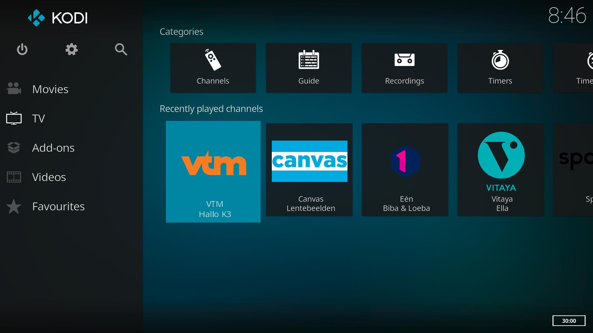
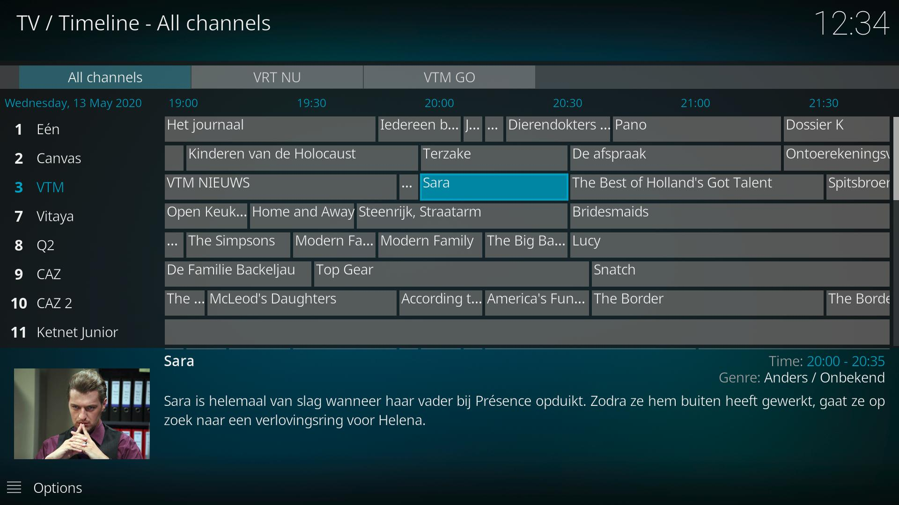
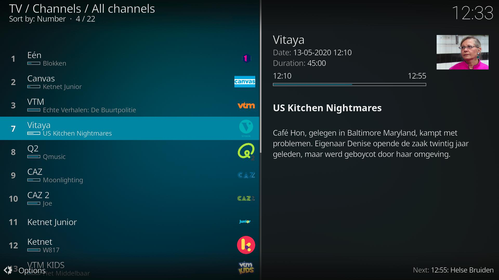
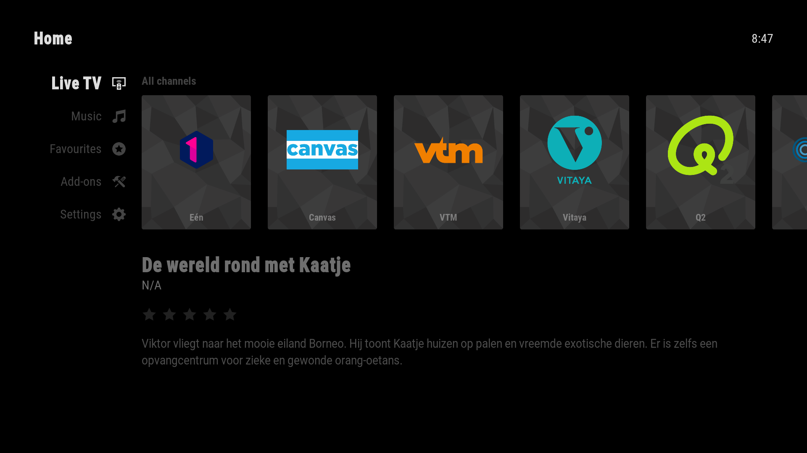
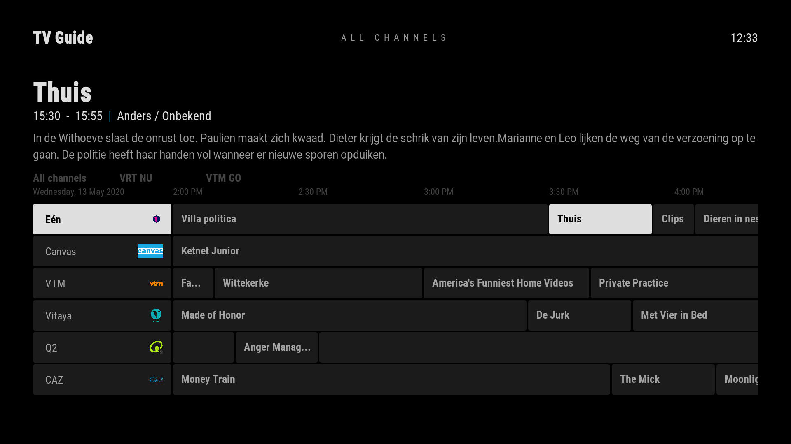
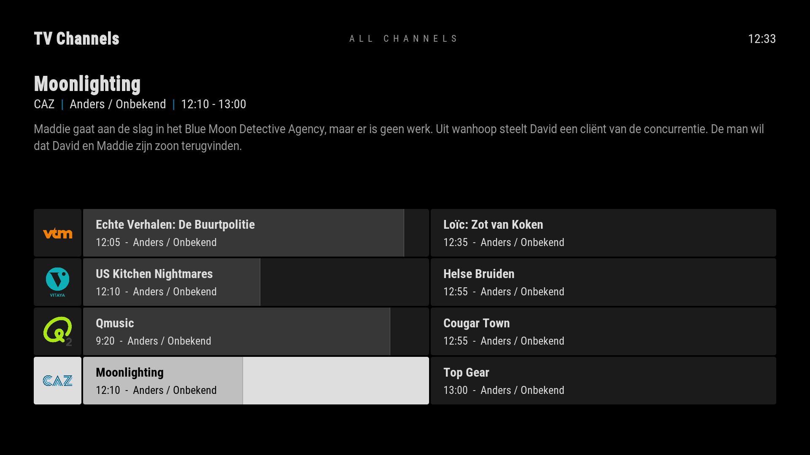

# IPTV Manager
This Service Add-on allows supported IPTV Add-ons to integrates their Live TV and Radio Channels in the Kodi TV integration.
IPTV Manager will periodically poll those Add-ons for Channels and EPG data, and generate a new M3U playlist and
XMLTV file that the Kodi PVR Addon [IPTV Simple](https://github.com/kodi-pvr/pvr.iptvsimple) can use. IPTV Manager
doesn't require a backend like TVHeadend since it handles all the streams inside Kodi. This is also the only way 
(that we know of) to play DRM protected streams with the Kodi TV integration.

> **Note:** IPTV Manager is still under development, and things might still change. The goal is to create an Add-on that
> can be included in the Kodi Add-on Repository, so we need to find a way that works best.

## Features
* Integrates Live TV Channels with EPG data in Kodi from supported IPTV Add-ons
* Allows playback of past and future programs directly from the EPG

## Supported Add-ons
* [Regio TV (plugin.video.regiotv)](https://github.com/add-ons/plugin.video.regiotv/)
* [TV Vlaanderen (plugin.video.tvvlaanderen)](https://github.com/add-ons/plugin.video.tvvlaanderen/)
* [VRT NU (plugin.video.vrt.nu)](https://github.com/add-ons/plugin.video.vrt.nu/)
* [VRT Radio (plugin.audio.vrt.radio)](https://github.com/add-ons/plugin.audio.vrt.radio/)
* [VIER-VIJF-ZES (plugin.video.viervijfzes)](https://github.com/add-ons/plugin.video.viervijfzes/)
* [VTM GO (plugin.video.vtm.go)](https://github.com/add-ons/plugin.video.vtm.go/)
* [Yelo (plugin.video.yelo)](https://github.com/add-ons/plugin.video.yelo)

Is your Add-on not listed above? Feel free to open a Pull Request to add it or let us know!

## Screenshots
<table>
  <tr>
    <td></td>
    <td></td>
    <td></td>
  </tr>
  <tr>
    <td></td>
    <td></td>
    <td></td>
  </tr>
</table>

Skin: [Arctic: Zephyr 2](https://forum.kodi.tv/showthread.php?tid=339791)

## Development
If you want to integrate your own Add-on with IPTV Manager, you can find more information in the
[Integration](https://github.com/add-ons/service.iptv.manager/wiki/Integration) document.

## Credits
* Huge thanks to [IPTV Simple](https://github.com/kodi-pvr/pvr.iptvsimple)
* We got inspiration from the [IPTV Merge](https://www.matthuisman.nz/2019/02/iptv-merge-kodi-add-on.html) addon from
  Matt Huisman, but decided to do things a bit differently.
